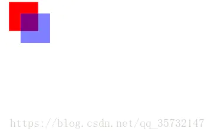
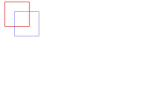
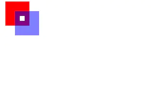
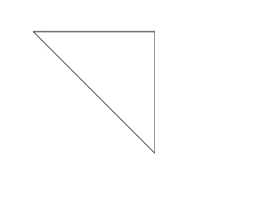
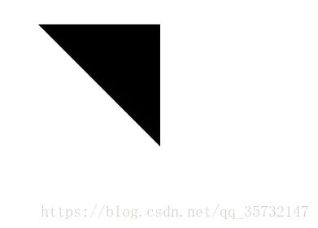
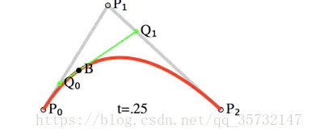

给大家简单介绍一下canvas在JS的用法及属性（如有介绍不到位 , 恳求各位大佬担待）;
目录
### 一、Canvas简介
### 二、Canvas基本用法
### 三、填充和描边
### 四、绘制矩形
### 五、绘制路径
* 5.1、绘制线段
* 5.2、绘制三角形
* 5.3、绘制圆弧
* 5.4、绘制贝塞尔曲线

#### 一、Canvas简 介
\<canvas>元素是HTML5新增的，一个可以使用脚本( 通常为JavaScript )在其中绘制图像的HTML元素。它可以用来制作照片集制作简单的动画，甚至可以进行实时视频处理和渲染。
\<canvas>由API构成，除了具备基本绘图能力的2D上下文，\<canvas>还具备一个名为WebGL的3D上下文。

#### 二、Canvas基本用法
使用\<canvas>元素之前，必须先设置width和height属性，指定可以绘图( 画布 )的区域大小。
出现在开始和结束标签中的内容是后备信息，如果浏览器不支持\<canvas>元素，就会显示这些信息。

```html
<canvas id = "drawing" width = "600" height = "600">A drwaing of something.</canvas>
```
要在这块画布上绘图，必须要使用getContext()方法传入参数"2d"取得2d上下文对象( 画笔 )。
```html
var drawing = document.getElementById("drawing");
//确定浏览器支持<canvas>元素
if（drawing.getContext {
        var ctx = drawing.getContext("2d");//取得2d上下文对象(画笔)
}
```
使用2d绘图上下文提供方法，可以绘制简单的2d图形，比如矩形、弧线和路径等等。
2d上下文的坐标开始于\<canvas>元素的左上角，原点坐标是（0，0）。
所有坐标值都基于这个原点计算，x值越大表示越靠右，y值越大越靠下。

#### 三、填充和描边
2d上下文的两种基本绘图操作是填充和描边。
填充就是指定的样式(颜色、渐变或图像) 填充图形，fill()默认为黑色，fillStyle = "任意颜色"。
描边就是图形边缘画线，*stroke()默认也是黑色，
strokeStyle = "任意颜色"来设置描边样式。
这两个属性的值可以是字符串、渐变对象或模式对象，例如：
```js
var drawing = document.getElementById("drawing");
//确定浏览器支持<canvas>元素
if(drawing.getContext) {
var ctx = drawing.getContext("2d");
//填充
ctx.fill();//默认黑色
ctx.fillStyle = "red" //设置为红色
//描边
ctx.stroke();//默认黑色
ctx.strokeStyle = "green"//设置为绿色
};
```
#### 四、绘制矩形
与绘制矩形有关的方法包括：  
fillRect()     
strokeRect()   
clearRect()  
这三个方法都是能接收四个参数：矩形的x坐标、矩形的y坐标矩形的width(宽)、矩形的height(高)，参数都是px(像素)。  
示例1
```js
var drawing = document.getElementById("drawing");
//确定浏览器支持<canvas>元素
if(drawing.getContext) {
var ctx = drawing.getContext("2d");
//绘制红色矩形
ctx.fillStyle  = "red";
ctx.fillRect(10,10,50,50);
}
```
  
示例2:

```js
        var drawing = document.getElementById("drawing");
        //确定浏览器支持<canvas>元素
        if(drawing.getContext){
            var context = drawing.getContext("2d"); //取得2D上下文对象
            //绘制红色描边矩形
            context.strokeStyle = "#F00";
            context.strokeRect(10, 10, 50, 50);
            //绘制半透明的蓝色描边矩形
            context.strokeStyle = "rgba(0, 0, 255, 0.5)";
            context.strokeRect(30, 30, 50, 50);
        }
```
  
示例3:
```js
        var drawing = document.getElementById("drawing");
        //确定浏览器支持<canvas>元素
        if(drawing.getContext){
            var context = drawing.getContext("2d"); //取得2D上下文对象
            //绘制红色矩形
            context.fillStyle = "#F00";
            context.fillRect(10, 10, 50, 50);
            //绘制半透明的蓝色描边矩形
            context.fillStyle = "rgba(0, 0, 255, 0.5)";
            context.fillRect(30, 30, 50, 50);
            //在两个矩形重叠的地方清除一个小矩形
            context.clearRect(40, 40, 10, 10);
        }
```
  
#### 五、绘制路径
绘制方法:  
·beginPath() ：表示要开始绘制新路径。 
·moveTo()：起点坐标(x,y)。  
·lineTo()：从起点坐标到开始绘制一条线，到(x,y)。  
·rect(x,y,width,height)：从点(x,y)开始绘制一个  矩形，宽度和高度分别由width和height指定。这个方法绘制的是矩形路径，而不是strokeRect()和fillRect()所绘制的独立的形状。
·arc(x,y,r,start,end,flase||true)：以(x,y)为圆心绘制一条弧线，弧线半径为r，起始结束角度 (用弧线表示)分别为start和end。最后一个参数true和flase是否按逆时针方向计算，(值为true表示按逆时针计算)  
·quadraticCurveTo(cx,cy,x,y)：绘制二次贝塞尔  
·bezierCyrverTo(c1x,c1y,c2x,c2y,x,y)：绘制三次贝塞尔曲线。  
·closePath()：绘制一条连接到路径起点的线条。 
·fill()：使用fillStyle填充已经完成的路径 
·stroke()：使用strokeStyle为已经完成的路径描边 

##### 5.1、绘制线段  
```js
        var drawing = document.getElementById("drawing");
        //确定浏览器支持<canvas>元素
        if(drawing.getContext){
            var context = drawing.getContext("2d"); //取得2D上下文对象
            context.beginPath();        //开始绘制新路径
            context.moveTo(50, 50);     //把画笔移动到指定的坐标
            context.lineTo(200, 50);    //绘制一条从当前位置到指定坐标(200, 50)的直线
            context.stroke();           //绘制
        }
 ```
##### 5.2、绘制三角形
绘制三角形边框：
```js
 var drawing = document.getElementById("drawing");
        //确定浏览器支持/<canvas>元素
        if(drawing.getContext){
            var context = drawing.getContext("2d"); //取得2D上下文对象  
            ctx.beginPath();           //开始绘制新路径
            ctx.moveTo(50,50);         //把画笔移动到指定的坐标
            ctx.lineTo(200,50);       //绘制一条从坐标(50, 50)到坐标(200, 50)的直线
            ctx.lineTo(200,200);    //绘制一条从坐标(200, 50)到坐标(200, 200)的直线
            ctx.closePath();      //闭合路径，绘制一条从路径起点到路径终点的直线
            ctx.stroke();       //为路径描边
        }
```
  
填充三角形：
```js
 var drawing = document.getElementById("drawing");
        //确定浏览器支持<canvas>元素
        if(drawing.getContext){
            var context = drawing.getContext("2d"); //取得2D上下文对象
            ctx.beginPath();           //开始绘制新路径
            ctx.moveTo(50,50);         //把画笔移动到指定的坐标
            ctx.lineTo(200,50);       //绘制一条从坐标(50, 50)到坐标(200, 50)的直线
            ctx.lineTo(200,200);    //绘制一条从坐标(200, 50)到坐标(200, 200)的直线
            ctx.closePath();      //闭合路径，绘制一条从路径起点到路径终点的直线
            ctx.stroke();       //填充三角形
         }
```

##### 5.3、绘制圆弧
```js
        var drawing = document.getElementById("drawing");
        //确定浏览器支持<canvas>元素
        if(drawing.getContext){
            var context = drawing.getContext("2d"); //取得2D上下文对象
            context.beginPath();        //开始绘制新路径
            context.arc(100, 100, 99, 0, Math.PI, false);   
            context.stroke();
        }
```
##### 5.4、绘制贝塞尔曲线
```js
        var drawing = document.getElementById("drawing");
        //确定浏览器支持<canvas>元素
        if(drawing.getContext){
            var context = drawing.getContext("2d"); //取得2D上下文对象
            context.beginPath();
            context.moveTo(10, 200);    //起始点
            var x1 = 40, y1 = 100;      //控制点
            var x2 = 200, y2 = 200;     //结束点
            //绘制贝塞尔曲线
            context.quadraticCurveTo(x1, y1, x2, y2);
            context.stroke();
            context.beginPath();
            context.rect(10, 200, 10, 10);
            context.rect(x1, y1, 10, 10);
            context.rect(x2, y2, 10, 10);
            context.fill();
        }
```
  
链接：https://www.jianshu.com/p/01e94b6d5ce9
来源：简书