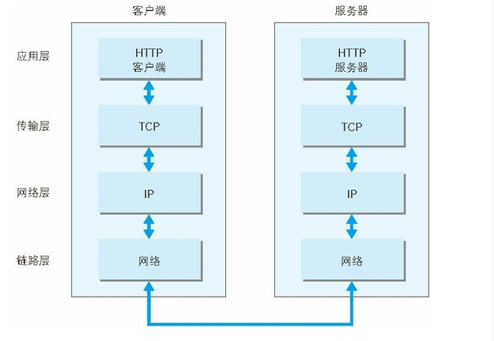
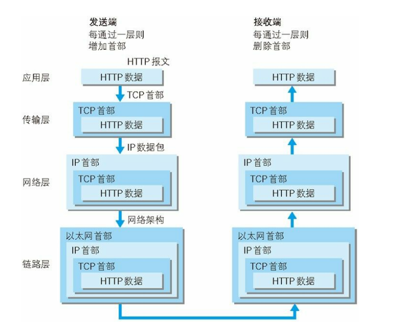
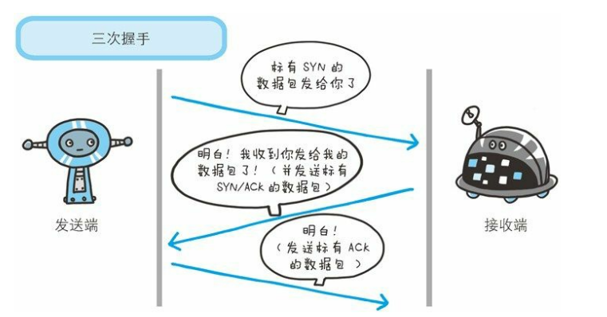

## 1 了解Web及网络基础
### 1.1 使用HTTP协议访问Web
**WWW构建技术**:  
1.SGML作为页面的文本标记语言的HTML  
2.作为文档传递协议的HTTP  
3.指定文档所在地址的URL 
### 1.3tcp/ip
#### 1.3.1TCP/IP协议族
TCP/IP是互联网相关的各类协议族的总称  
#### 1.3.2TCP/IP的分层管理 
1.**应用层**  
向用户提供应用服务的通信活动 FTP(文件传输协议)DNS(域名系统)  HTTP在该层  
2.**传输层**
为应用层提供网络连接中的两台计算机之间的数据传输 TCP UDP  
3.**网络层**  
处理网络上流动的数据包。 （规定传输路线到达对方计算机，并把数据包传送给的对方）（在众多选项内选择一条传输路线）  

4.**链路层**（网络接口层）  
处理连接网络的硬件部分  
#### 1.3.3tcp/ip 通信传输流
发送端从应用层往下走，接收端则往应用层往上走  
 
eg
  

层与层之间传输数据时，每经过一层必定会被打上一个该层所属的首部信息。  
这种把数据信息包装起来的做法称为封装
### 1.4 IP TCP DNS协议
**IP**:位于网络层  
**IP协议**：把各种数据包传送给对方  
**IP地址**:指明节点被分配到的地址  
**MAC地址**:网卡所属的固定地址（ip变网卡一般不变）  
ip之间的通信依赖MAC地址。通信双方在同一局域网中的情况是很少的，中转设备的MAC地址搜索下一个中转目标  
**APR协议**：解析地址的协议（通过通信双方的IP地址就可以反查处对应的MAC地址）  
**TCP**：传输层 提供可靠的字节流服务(将大块数据分割成以报文段为单位的数据包)。  
三次握手策略：  
### 1.5 DNS服务
**DNS**：应用层  
提供域名到IP地址之间的**解析服务**。   
计算机一般通过域名或主机名来访问对方的计算机  
### 1.7 URI URL
**URI(统一资源标识符号)**：标识某一互联网资源。
**URL()**：资源的地点
#### 1.7.2 URI格式 
  
使用 http: 或 https: 等协议方案名获取访问资源时要指定协议类型。不
区分字母大小写,最后附一个冒号(:)。  
也可使用 data: 或 javascript: 这类指定数据或脚本程序的方案名。  
登录信息(认证)  
指定用户名和密码作为从服务器端获取资源时必要的登录信息(身份
认证)。此项是可选项。  
* 服务器地址  
使用绝对 URI 必须指定待访问的服务器地址。地址可以是类似
hackr.jp 这种 DNS 可解析的名称,或是 192.168.1.1 这类 IPv4 地址
名,还可以是 [0:0:0:0:0:0:0:1] 这样用方括号括起来的 IPv6 地址名。  
* 服务器端口号  
指定服务器连接的网络端口号。此项也是可选项,若用户省略则自动使用默认端口号。  
* 带层次的文件路径    
指定服务器上的文件路径来定位特指的资源。这与 UNIX 系统的文件查询字符串  
针对已指定的文件路径内的资源,可以使用查询字符串传入任意参
数。此项可选。  
* 片段标识符  
使用片段标识符通常可标记出已获取资源中的子资源(文档内的某个
位置)。但在 RFC 中并没有明确规定其使用方法。该项也为可选
项。  
## 2 简单的HTTP协议
### 2.2  通过请求和响应的交换达成通信  
请求报文是由请求方法、请求 URI、协议版本、可选的请求首部字段
和内容实体构成的。

http是一种不保存状态的协议 >>  引入cookie技术，管理状态  
### 2.4 请求URI定位资源
http协议使用URI定位互联网上的资源
**请求URI的方法**：  
*  URI为完整的请求URI ：'GET  http://hackr.jp/index.htmHTTP/1.1'
* 在首部字段Host中写明网络域名或IP地址'  

**HTTP/1.1方法**  
GET :获取资源 
POST:传输实体主体  
POST 的主要目的并不是获取响应的主体内容。  
PUT:传输文件  
HEAD:获得报文首部  
DELETE :删除文件
OPTIONS:询问支持的方法  TRACE:追踪路径  
CONNECT:要求用隧道协议连接代理 
与代理服务器通信时建立隧道,实现用隧道协
议进行 TCP 通信  
### 2.7持久连接节省通信量  
1持久连接：
目的:解决每次的请求都会造成无谓的 TCP 连接建立和断开  
建立 1 次 TCP 连接后进行多次请求和响应的交互  
2管线化技术:不用等待响应直接发送下一个请求  
3使用cookie状态管理:  
通过在请求和响应报文中写入 Cookie 信息来控制客户端的状态。  
1. 请求报文(没有 Cookie 信息的状态)
```
GET /reader/ HTTP/1.1
Host: hackr.jp
*首部字段内没有Cookie的相关信息
```
2. 响应报文(服务器端生成 Cookie 信息)
```
HTTP/1.1 200 OK
Date: Thu, 12 Jul 2012 07:12:20 GMT
Server: Apache
<Set-Cookie: sid=1342077140226724; path=/; expires=Wed,
10-Oct-12 07:12:20 GMT>
Content-Type: text/plain; charset=UTF-8
```
3. 请求报文(自动发送保存着的 Cookie 信息)
```
GET /image/ HTTP/1.1
Host: hackr.jp
Cookie: sid=1342077140226724
```
## 3 HTTP 报文内的 HTTP信息
### 3.1http报文

HTTP协议交互的信息被称为http报文  
请求端(客户端)的HTTP 报文叫做**请求报文**,响应端(服务器端)的叫做**响应报文**。  
HTTP 报文大致可分为报文首部和报文主体两块  
**报文首部**：服务端或客户端需处理的请求或响应的内容及属性  
**报文主体**:应被发送的数据  

* 请求行  
包含用于请求的方法,请求 URI 和 HTTP 版本。  
* 状态行  
包含表明响应结果的状态码,原因短语和 HTTP 版本。  
* 首部字段  
包含表示请求和响应的各种条件和属性的各类首部。  
一般有 4 种首部,分别是:通用首部、请求首部、响应首部和实体首部。  
####  3.3.2 压缩传输的内容编码  
 指明应用在实体内容上的编码格式。  
 常见的内容编码  
 * gazip(GNUzip)  
 * compress(UNIX系统的标准压缩)  
 * deflate(zlib)
 * identity(不进行编码 
 #### 3.3.3分割发送的分块（chunk）传输编码  
**原因**：在 HTTP 通信过程中,请求的编码实体资源尚未全部传输完成之前,浏览器无法显示请求页面。  
 **目地**：能够让浏览器逐步显示页面。  
 使用分块传输编码的实体主体会由接收的客户端负责解码,恢复到编码前的实体主体。  
### 3.4发送多种数据的多部分对象集合  
MIME机制，邮件处理文本、图片、视频等多个不同类型数据。在 MIME 扩展中会使用一种称为**多部分对象集合**(Multipart)的方法,来容纳多不同类型的数据。  
HTTP 协议中也采纳了多部分对象集合  
* multipart/form-date    
在 Web 表单文件上传时使用。  
* multipart/byteranges  

状态码 206(Partial Content,部分内容)响应报文包含了多个范围的内容时使用。  
**提示**：在 HTTP 报文中使用多部分对象集合时,需要在首部字段里加上Content-type。  
### 3.5获取部分内容的范围请求  
**原因**：如果下载过程中遇到网络中断的情况,那就必须重头开始。为了解决上述问题,需要一种**可恢复的机制**。  所谓恢复是指能从之前下载中断处恢复下载。  
**方法**：指定下载的实体范围。  
**范围请求(Range Request)**：指定范围发送的请求。  
使用首部字段Range来指定资源的byte范围  
**byte范围的制定形式**：（自己查）  
提示：对于多重范围的范围请求,响应会在首部字段 Content-Type 标明multipart/byteranges 后返回响应报文。  
### 3.6内容协商返回最合适的内容  
**内容协商机制**：客户端和服务端就响应的资源内容进行交涉，然后提供给客户端最为适合的资源  
**判断依据**：响应资源的语言，字符集，编码方式。  
**三种内容协商技术**  
1. 服务器驱动协商   
2. 客户端驱动协商
3. 透明协商
## 4 返回结果的http状态玛
### 4.1 状态码告知从服务器端返回的请求结果  
状态码类别：  
|   |类别|原因短语|
|:------|:------|:------|
|1XX| Informational(信息性状态码) |接收的请求正在处理
2XX |Success(成功状态码) |请求正常处理完毕
3XX |Redirection(重定向状态码)| 需要进行附加操作以完成请求
4XX |Client Error(客户端错误状态码) |服务器无法处理请求
5XX |Server Error(服务器错误状态码) |服务器处理请求出错  
具体 ……………………  

## 5 与HTTP协作的Web服务器  

### 5.1 用单台虚拟主机实现多个域名  
一个http服务器可以拥有多个Web站点。这是因为利用了虚拟主机的功能  .
**问题**：因为同一台服务器托管了两个域名，用DNS服务解析域名后，两者的ip地址相同。
**解决办法**：在发送http请求时，在Host首部内完整指定主机名或域名的URI  
### 5.2 代理、网关、隧道    

#### 5.2.1代理  

代理服务器的基本行为就是接收客户端发送的请求后转发给其他服务器。  
源服务器：持有资源实体的服务器  
via首部字段标记经过的主机信息  
**代理的方法**   

* 缓存代理：预先将缓存保存在代理服务器上，接受到对相同资源的请求时，将缓存返回  。  
若缓存失败，缓存服务器从源服务器上获取新资源。  
缓存可以在客户端浏览器中
* 透明代理：部队报文进行加工  
#### 5.2.2 网关  

由http请求转化为其他通信协议
  
提高通信的安全性
#### 5.2.3隧道    

隧道可按要求建立起一条与其他服务器的通信线路,届时使用 SSL 等加密手段进行通信  
为了安全  
## 6 HTTP首部  

### 6.1 http报文首部  

就很多
## 7 https  

http缺点：
* 通信不加密，内容被窃听  
* 不验证身份，遭遇伪装  
* 无法证明完整，报文被篡改    

窃听：收集在互联网上的流动的数据。解析工作交给那些抓包或嗅探器工具。  
**防窃听**：  
1.加密
* 通信加密 通过和 SSL(Secure Socket Layer,安全套接层)或TLS(Transport Layer Security,安全层传输协议)的组合使用,加密 HTTP 的通信内容。
* 内容加密 前提：客户uan端和服务器同时具有加密和解密的机制。  
2.认证
*  查明对手的证书 通过SSL。  
3.完整性保护  
* MD5 和 SHA-1 等散列值校验的方法,以及用来确认文件的数字签名方法。  
### HTTP+ 加密 + 认证 + 完整性保护=HTTPS
HTTP通信接口用SSL和TSL协议代替 => HTTPS有那些功能  
**困境**：共享密钥加密困难，通信被监听，密钥暴露  
**方案**： 公开加密技术，使用一对密钥，一把是密钥，另一把是公开密钥。发送密文使用对方的公开密钥，自己的私有密钥解密。   
证明公开密钥正确性的证书  
SSL的慢：通信慢和消耗CPU及内存等资源，处理速度慢  
## 10 构建Web内容的技术   
HTML CSS
DOM是用以操作HTML文档和XML文档的API,使用JavaScript等脚本语言对DOM的操作，可以更为见到你的方式控制HTML的改变
### WEB应用  
由程序创建的内容动态内容   
事先准备好的内容静态内 容    

**CGI**
**Servet**
**XML**SGML
**RSS/Atom**
ajax技术  **JSON**  
## 6  HTTP首部 字段
## 8 各种认证
## 9 基于HTTP的追加协议
## 11 Web的攻击技术

