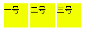
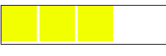

### 一、产生间隙的原因
书写html代码中，为了美观易读，标签结束后会回车换行，解析后会生成一个字符。    

 
[链接]((https://codepen.io/liaoyulu/pen/WNNzGGe))
```html
<style type="text/css">
    child{
    width:50px;
    height:50px;
    background-color:yellow;
    display:inline-block;
}
</style>
<div class="parent">
    <div class="child">一号</div>
    <div class="child">二号</div> 
   <div class="child"> 三号</div>
</div>
```
**提示**：在IE8-9，火狐，safari，chrome（在chrome下为8px）中，inline-block的元素之间存在“4px”的空白。
### 二、消除间隙的方法
#### （1）移除标签间的空格（不建议）
1.将代码写成一行   
```html
 <div class="parent">
    <div class="child">一号</div><div class="child">二号</div> <div class="child">三号</div>
</div>
```
2.将上一行的结束标签与下一行的开始标签写在一起  
```html
 <div class="parent">
    <div class="child">一号</div><div class="child">
   二号</div><div class="child"> 三号
   </div>
</div>
```

3.在两行代码之间加注释标签  
```html
<div class="parent">
  <div class="child">一号</div><!--
--><div class="child">二号</div><!--
--><div class="child">三号</div>
</div>
```
4.标签不闭合
```html
<div class="parent">
    <div class="child">一号
    <div class="child">二号
    <div class="child">三号
</div>
```
####  （2）在font-size:0;
给父元素设置font-size:0,给子元素设置字体大小.
``` css
.child{
  width:50px;
  height:50px;
  background-color:yellow;
  display:inline-block;
  font-size:14px;
}
.parent{
  font-size:0;
}
```
#### （3）负margin  
```css
.child{
  width:50px;
  height:50px;
  background-color:yellow;
  display:inline-block;
  margin:-2px;
}
```
由于外部环境的不确定性，以及最后一个元素多出的负margin值等问题，这个方法不适合大规模使用。

#### （4）letter-spacing  
父元素
```css
.child{
    letter-spacing:0px;
}
.parent{
    letter-spacing:-4px;
}
```
#### （5）float:left  
一般文字图片混排用inline-block，如果页面整体布局就用float，用伪类after、before清除浮动即可.
```css
.child{
  width:50px;
  height:50px;
  background-color:yellow;
  display:inline-block;
  float:left;
  }
.parent:after{
  content:"";
   clear:both;
   display: block;
}
.parent{
 border:1px solid;
}
```
#### （6）display:table和word-spacing
一个是字符间距(letter-spacing)一个是单词间距(word-spacing)，word-spacing的负值只要大到一定程度，其兼容性上的差异就可以被忽略。因为，貌似，word-spacing即使负值很大，也不会发生重叠。  
果您使用Chrome浏览器，可能看到的是间距依旧存在,可以添加display: table;或display:inline-table;

```css
.parent{
  display: table;
  word-spacing:-1em;
  } 
```
### 三、补充
有时候inline-block还会遇到顶部不在一个基准线的情况（垂直方向上产生的间隙  
  
**解决办法**:  
1. 在每一个子元素上加一个属性vertical-align:top;(或者值是bottom,看具体效果)就在子元素上加vertical-align:bottom;
2. 如果子标签内加上任意文字，则display:inline-block元素不会生成垂直方向有空白
#### 参考：
1.[去除inline-block元素间间距的N种方法]( https://www.zhangxinxu.com/wordpress/2012/04/inline-block-space-remove-%E5%8E%BB%E9%99%A4%E9%97%B4%E8%B7%9D/)<br>
2.[详解CSS 去掉inline-block元素间隙的几种方法](https://www.jb51.net/css/645772.html)  
3.[display:inline-block元素之间空隙的产生原因和解决办法](https://blog.csdn.net/qq_32614411/article/details/82223624)

